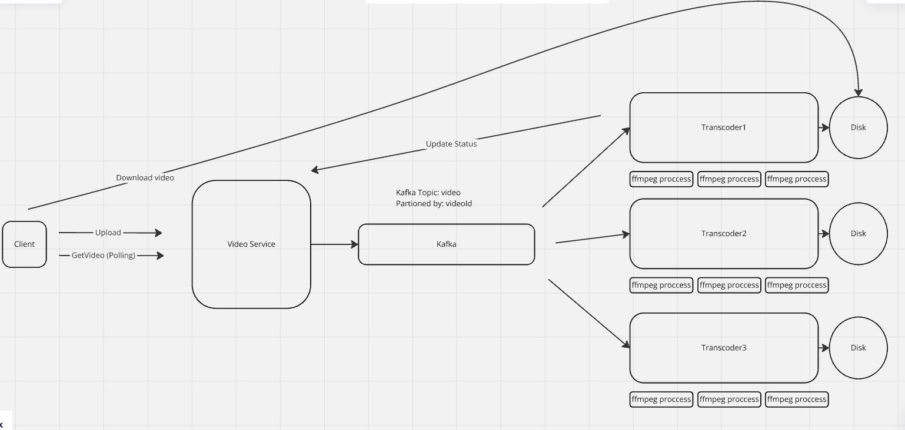

# Distributed Video Transcoder

This project is a distributed video transcoder built using distributed systems principles.

## Overview

The **Distributed Video Transcoder** enables users to upload videos and receive download links for the videos in multiple formats.

### Functional Requirements

- Users can upload videos and receive download links for the transcoded videos in different formats.

### Non-Functional Requirements

- The system can handle a high volume of concurrent users.
- The system is fault-tolerant to ensure reliability.
- The transcoded videos are returned in consistent quality without corruption.

---

## Architecture

For an overview of the system design, refer to the architecture diagram:  


---

## Running the Project Locally

Follow the steps below to set up and run the project locally:

### Prerequisites

- [Docker](https://docs.docker.com/get-docker/) installed on your machine.
- [Go Migrate CLI](https://github.com/golang-migrate/migrate) installed for managing database migrations.

### Steps

1. **Install Docker**  
   Ensure Docker is installed and running on your machine.

2. **Run Kafka with Docker Compose**  
   Start the Kafka service:

   ```bash
   docker-compose up -d kafka
   ```

3. **Create Kafka Topic**  
   Access the Kafka container and create a topic named `video`:

   ```bash
   docker-compose exec kafka /bin/bash
   kafka-topics.sh --create --zookeeper zookeeper:2181 --replication-factor 1 --partitions 3 --topic video
   exit
   ```

4. **Run PostgreSQL with Docker Compose**  
   Start the PostgreSQL service:

   ```bash
   docker-compose up -d postgres
   ```

5. **Apply Database Migrations**  
   Apply the migrations to set up the database schema:

   ```bash
   migrate -path video-service/db/migration -database "postgres://postgres@localhost:5000/postgres?sslmode=disable" -verbose up
   ```

6. **Start the Services**  
   Restart all services to ensure everything is up and running:

   ```bash
   docker-compose down && docker-compose up -d
   ```

7. **Access the Application**  
   Open your browser and navigate to [http://localhost:8080](http://localhost:8080) to use the application.
